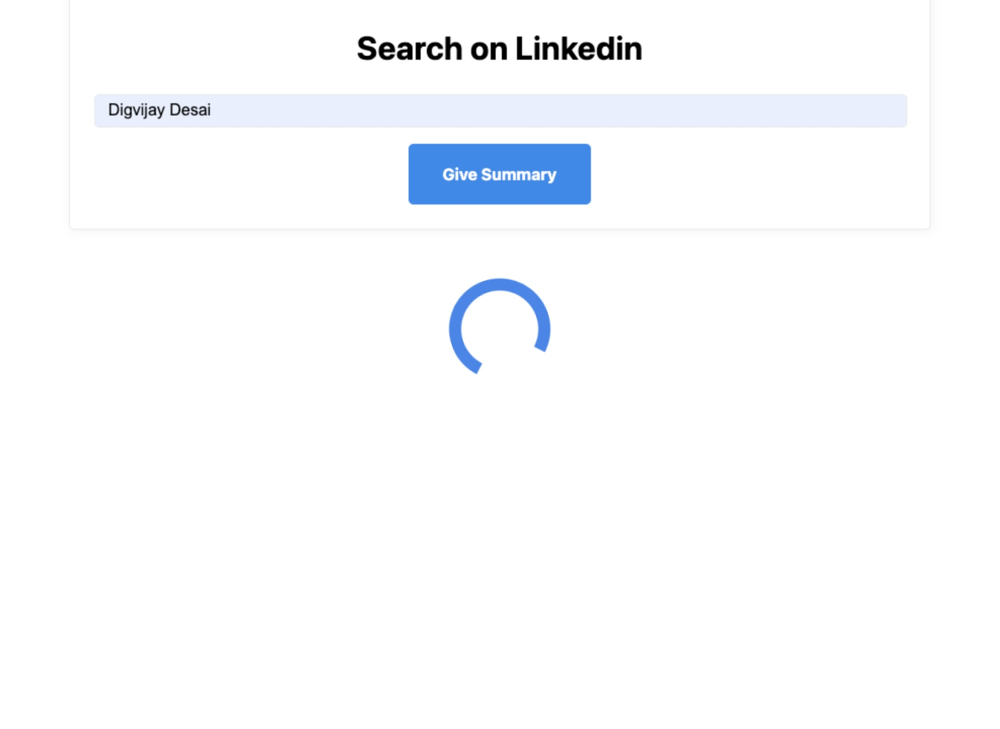
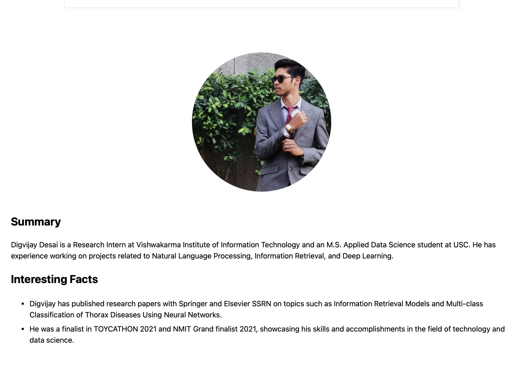

# SearchME

SearchME is a website that provides a summary of a person by searching for them on Google, finding their LinkedIn profile, and providing a summary of their information. Currently, it only supports LinkedIn summaries, but it will be adding more websites like Google Scholar, Twitter, Instagram, and others in the future.

**Key Features:**

- **LinkedIn Summary Extraction:** Efficiently extracts key information from LinkedIn profiles.
- **Scalable Design:** Built for future expansion to include additional platforms.
- **User-Friendly Interface:** Provides a straightforward interface for easy information retrieval.

**Prerequisites**

Ensure you have the following environment variables set in your `.env` file:

- `PYTHONPATH=/{YOUR_PATH_TO_PROJECT}/ice_breaker`
- `ANTHROPIC_API_KEY` (for use with OpenAI)
- `PROXYCURL_API_KEY` (for use with ProxyCurl)
- `TAVILY_API_KEY` (for use with Tavily)
- `TWITTER_API_KEY` (for potential future use with Twitter) (requires paid subscription)
- `TWITTER_API_SECRET` (for potential future use with Twitter)
- `TWITTER_ACCESS_TOKEN` (for potential future use with Twitter)
- `TWITTER_ACCESS_SECRET` (for potential future use with Twitter)

## Installation

1. Clone the repository:

2. Navigate to the project directory:
cd SearchME

3. Install dependencies using Pipenv:
pipenv install

1. Start the Flask server:
pipenv run app.py

2. Access the application in your web browser at `http://localhost:8000` or the appropriate URL.

3. Search for a person, and the application will provide a summary of their information from LinkedIn and other supported websites.

# Tech Stack Powering SearchME

## Large Language Models (LLMs) 
(Potential Future Integration): While not currently implemented, the potential to integrate LLMs like Bard (me!) or similar systems within SearchME exists. LLMs could enhance information extraction from various sources, including text-based profiles beyond LinkedIn.

## LinkedIn API
This API grants SearchME access to public LinkedIn profile data, enabling the extraction of key information like name, job title, education, and skills.

## Flask
This lightweight, versatile web framework forms the foundation of SearchME's web application. Flask facilitates efficient creation of the user interface, handles interactions, and coordinates communication with the LinkedIn API.

## Example

**Searching Image:** 

    

**Output Image:** 

    

## Contributing

Contributions are welcome! Please follow the guidelines in the [CONTRIBUTING.md](CONTRIBUTING.md) file.

## License

This project is licensed under the [MIT License](LICENSE).
